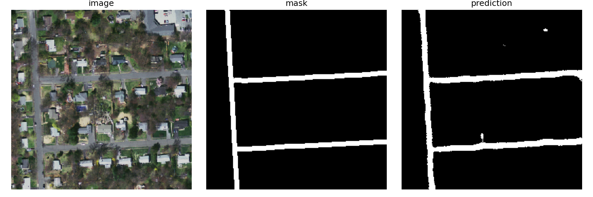
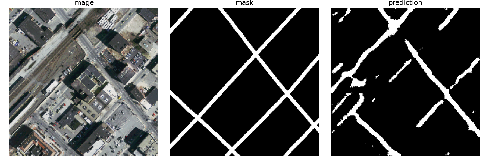
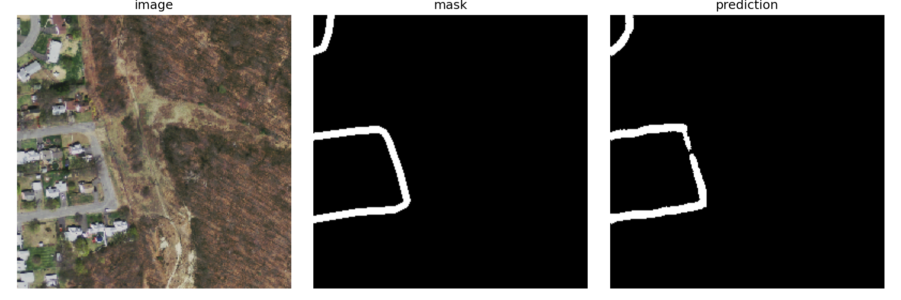
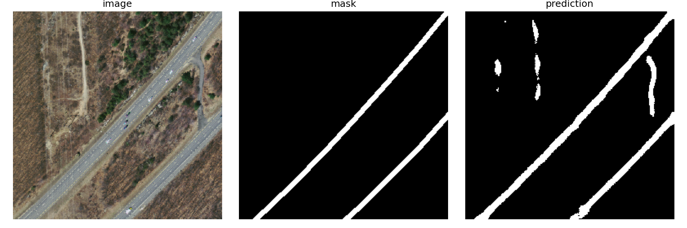

# Road Segmentation from Satellite Imagery

Semantic segmentation of roads in satellite images using deep learning. Two architectures implemented: **ResNet18 U-Net** and **ResNet18 FPN** (Feature Pyramid Network).

Built on the [Massachusetts Roads Dataset](https://www.kaggle.com/datasets/balraj98/massachusetts-roads-dataset) from Kaggle.

## Results

| Model | Val Dice @ 0.50 | Best Threshold | Threshold Val Dice |
|-------|-----------------|----------------|--------------------|
| ResNet18 FPN | 0.6703 | 0.35 | **0.6920** |

Sample predictions:

<table>
  <tr>
    <td></td>
    <td></td>
    <td></td>
    <td></td>
  </tr>
</table>

## Architectures

### ResNet18 U-Net (`model/main.py`)
Classic U-Net with a ResNet18 encoder. Skip connections preserve spatial information during decoding.

### ResNet18 FPN (`model/fpn.py`)
Feature Pyramid Network with a ResNet18 backbone. Fuses features from multiple pyramid levels for multi-scale segmentation.

**Shared settings:**
- Encoder: ResNet18 (ImageNet pretrained)
- Loss: BCEWithLogitsLoss
- Metric: Dice coefficient
- Patch size: 256×256

## Project Structure

```
├── model/
│   ├── main.py                             # ResNet18 U-Net training & inference
│   └── fpn.py                              # ResNet18 FPN training & inference
├── scripts/
│   ├── rebalance_dataset_splits.py         # Train/val/test split (70/15/15)
│   ├── filter_white_train_tiles.py         # Remove blank (white) tiles
│   ├── create_threshold_val_split.py       # Create threshold-tuning split
│   ├── prepare_dataset2_on_server.py       # Server-side dataset preparation
│   ├── analyze_trained_fpn_outputs.py      # Analyze model predictions
│   └── analyze_remote_segmentation_data.py # Segmentation statistics
├── dataset2_balanced/                      # Processed dataset
│   └── tiff/
│       ├── train/ + train_labels/
│       ├── val/ + val_labels/
│       ├── test/ + test_labels/
│       └── threshold_val/ + threshold_val_labels/
└── server_results/                         # Model weights & visualizations
    ├── best_model.pth
    ├── metrics.png
    └── prediction_*.png
```

## Installation

```bash
pip install torch torchvision pillow numpy matplotlib tifffile
```

Python 3.7+ required. GPU (CUDA) recommended for training.

## Usage

### 1. Prepare the dataset

Download the dataset from [Kaggle](https://www.kaggle.com/datasets/balraj98/massachusetts-roads-dataset), then:

```bash
# Split into train/val/test
python scripts/rebalance_dataset_splits.py \
    --source-root dataset2 \
    --output-root dataset2_balanced

# Remove blank (white) tiles from training set
python scripts/filter_white_train_tiles.py \
    --dataset-root dataset2_balanced/tiff

# Create a separate split for threshold tuning
python scripts/create_threshold_val_split.py \
    --dataset-root dataset2_balanced/tiff
```

### 2. Train

```bash
# U-Net
python model/main.py

# FPN
python model/fpn.py
```

### 3. Analyze results

```bash
python scripts/analyze_trained_fpn_outputs.py
python scripts/analyze_remote_segmentation_data.py
```

## Training Hyperparameters

| Parameter | Value |
|-----------|-------|
| Patch size | 256×256 |
| Patches per image | 48 |
| Batch size | 64 |
| Stage 1 (frozen encoder) | 5 epochs, LR=0.01 |
| Stage 2 (all layers) | 15 epochs, LR=0.001 |
| Optimizer | SGD, momentum=0.9 |
| Weight decay | 1e-4 |
| LR scheduler | StepLR (step=4, γ=0.5) |
| Random seed | 42 |

## Dataset

- **Source:** [Massachusetts Roads Dataset](https://www.kaggle.com/datasets/balraj98/massachusetts-roads-dataset) (Kaggle)
- **Format:** TIFF aerial images
- **Masks:** binary (road=255, background=0)
- **Augmentation:** horizontal flip
- **Normalization:** ImageNet mean/std
- **Threshold tuning:** sweep from 0.05 to 0.50 on a dedicated `threshold_val` split

## Two-Stage Training

Transfer learning is split into two stages:

1. **Stage 1** — early encoder layers are frozen; only the decoder head is trained. Fast adaptation to the segmentation task.
2. **Stage 2** — all layers unfrozen, fine-tuned with a lower learning rate. Refines encoder features for the aerial imagery domain.
